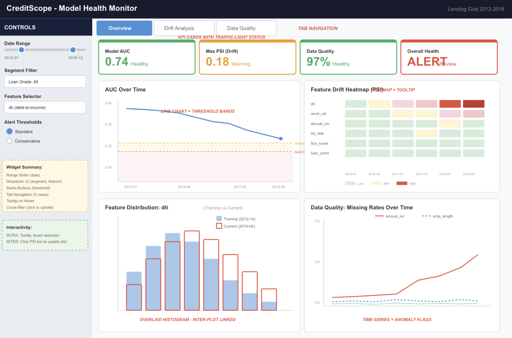

# CreditScope — Credit Risk Model Health Monitor

> An interactive dashboard for monitoring credit scoring model performance, detecting population drift, and tracking data quality over time. Built with Python, Altair, and Dash.

**🌐 Live App:** https://data551-creditscope.onrender.com/

**[📋 Proposal](doc/proposal.md)** · **[📝 M2 Reflection](doc/reflection-milestone2.md)** · **[📝 M4 Reflection](doc/reflection-milestone4.md)**

---

## About

CreditScope is a model monitoring dashboard for credit risk managers and model validators. Using the public Lending Club loan dataset (2.26M loans, 2007–2018), it simulates a common workflow: a credit scoring model is trained on historical data and then monitored as new loan cohorts arrive.

We use a curated 2012–2018 subset (~100k loans) with a stratified working sample (~50k loans) that preserves key segment structure (e.g., loan grade and issue period). A logistic regression model trained on 2012–2014 data serves as the baseline, and the dashboard tracks its behavior across 2015–2018 quarterly cohorts.

The dashboard helps answer questions like:

- How does model AUC evolve over time, overall and across borrower segments?
- Which input features show the strongest population drift relative to the training baseline?
- Is the model's calibration degrading — is it over- or under-predicting default risk?
- Do changes in data quality (missingness, record counts) coincide with weaker model performance?

---

## App Description

The app uses a **sidebar + main-content** layout with three tabs.

### Left Sidebar — Controls

- **Date range slider**: Select the monitoring window (quarterly cohorts, 2012–2018).
- **Segment filter dropdown**: Break down metrics by loan grade (A–G).
- **Feature selector dropdown**: Choose which input feature to inspect in the drift view.
- **Threshold toggle** (radio buttons): Switch between standard and conservative alert thresholds for PSI and AUC.
- **Abbreviation tooltips**: Hover over AUC, PSI, and DQ info icons for one-line explanations.

### Tab 1 — Model Performance

- **KPI cards** for Overall Health, Model AUC, Max PSI (Drift), and Data Quality, each with traffic-light color coding and a badge showing the trigger (e.g., "Warning — driven by PSI").
- **AUC time-series line chart** with configurable warning and alert threshold lines.
- **Collapsible Dashboard Guide** explaining what CreditScope tracks and how to interpret the charts.

### Tab 2 — Drift Analysis

- **PSI heatmap** summarizing drift intensity across features and quarters, with a star marking the latest quarter.
- **Calibration scatter plot** comparing predicted vs. observed default rates across baseline and monitoring periods.
- **PSI bar chart** ranking monitored features by drift score for the latest quarter.
- **Distribution comparison chart** — overlaid histograms showing the training baseline (filled) vs. current selection (outlined) for the selected feature.

### Tab 3 — Data Quality

- **Four individual missing-rate trend charts**, one per monitored feature (Debt-to-Income, Interest Rate, Annual Income, Loan Amount).
- **Loan volume bar chart** by quarter, colored by observed default rate, to detect volume anomalies.

---

## App Sketch



---

## Installation & Running Locally

```bash
# Clone the repository
git clone https://github.com/UBCTAO/DATA551_Creditscope.git
cd DATA551_Creditscope

# Install dependencies
pip install -r requirements.txt

# Run the app
python src/app.py
```

Then open http://127.0.0.1:8050 in your browser.

---

## Data Notes

- **Source:** Lending Club public dataset on Kaggle (2007–2018, ~2.26M records, CC0 license).
- **Scope:** 2012–2018 to keep variable definitions consistent after platform changes.
- **Working sample:** Stratified ~50k loans preserving grade and time distributions.
- **Baseline model:** Logistic regression trained on 2012–2014 data, monitored on 2015–2018 cohorts.

---

## Contributing

We welcome contributions! Please see [CONTRIBUTING.md](CONTRIBUTING.md) for guidelines.

## License

This project is licensed under the MIT License — see [LICENSE](LICENSE) for details.
